# 📋 API Test Results

## ✅ Ringkasan Hasil Testing

| No | Method | Endpoint | Status Diharapkan | Status Aktual | Hasil |
|---|---|---|---|---|---|
| 1 | `POST` | `/items` | `201 Created` | `201 Created` | ✅ PASS |
| 2 | `POST` | `/items` | `201 Created` | `201 Created` | ✅ PASS |
| 3 | `POST` | `/items` | `201 Created` | `201 Created` | ✅ PASS |
| 4 | `GET` | `/items` | `200 OK` | `200 OK` | ✅ PASS |
| 5 | `GET` | `/items?search=laptop` | `200 OK` | `200 OK` | ✅ PASS |
| 6 | `GET` | `/items/8` | `200 OK` | `200 OK` | ✅ PASS |
| 7 | `GET` | `/items/9` | `200 OK` | `200 OK` | ✅ PASS |
| 8 | `GET` | `/items/10` | `200 OK` | `200 OK` | ✅ PASS |
| 9 | `PUT` | `/items/8` | `200 OK` | `200 OK` | ✅ PASS |
| 10 | `GET` | `/items/8` | `200 OK` (data terupdate) | `200 OK` | ✅ PASS |
| 11 | `GET` | `/items/stats` | `200 OK` | `200 OK` | ✅ PASS |
| 12 | `DELETE` | `/items/8` | `204 No Content` | `204 No Content` | ✅ PASS |
| 13 | `GET` | `/items/8` | `404 Not Found` | `404 Not Found` | ✅ PASS |
| 14 | `GET` | `/team` | `200 OK` | `200 OK` | ✅ PASS |

**Total: 14/14 test PASS ✅**

---

## 📖 Penjelasan Alur Testing

Pengujian dilakukan secara berurutan untuk mensimulasikan alur penggunaan API secara nyata — mulai dari menambah data, membaca, memperbarui, mencari, hingga menghapus dan memverifikasi hasilnya.

---

### Langkah 1: Menambahkan Data Baru (POST)

Pada rangkaian langkah pertama ini, pengguna melakukan operasi POST ke endpoint `/items` untuk menambahkan tiga buah produk ke dalam database. Pada **Langkah 1.1**, sebuah item bernama "Laptop" dengan harga 15.000.000 dan stok 5 berhasil ditambahkan (mendapat ID 8). Kemudian pada **Langkah 1.2**, ditambahkan item "Mouse Wireless" seharga 250.000 dengan stok 20 (mendapat ID 9). Terakhir pada **Langkah 1.3**, pengguna menambahkan "Keyboard Mechanical" seharga 1.200.000 dengan stok 8 (mendapat ID 10). Ketiga request ini menghasilkan respon status code `201 Created`, yang menandakan data telah sukses disimpan di server.

---

### Langkah 2: Menampilkan Semua Data (GET List)

Langkah ini menunjukkan penggunaan metode GET pada endpoint `/items` untuk mengambil seluruh daftar produk yang tersimpan. Pengguna menggunakan parameter default seperti `skip=0` dan `limit=20`. Hasilnya, server memberikan respon `200 OK` dengan body JSON yang berisi total data dan array item yang telah diinput sebelumnya, yaitu Keyboard Mechanical, Mouse Wireless, dan Laptop, lengkap dengan detail ID dan waktu pembuatan masing-masing.

---

### Langkah 3: Menampilkan Detail Item Berdasarkan ID (GET Item)

Pada langkah ketiga, dilakukan pengujian untuk mengambil data spesifik menggunakan metode GET pada endpoint `/items/{item_id}`. Pengguna memasukkan nilai `8` pada parameter `item_id`. Server merespon dengan status `200 OK` dan menampilkan detail lengkap khusus untuk item "Laptop", yang membuktikan bahwa fungsi pencarian berdasarkan ID unik berjalan dengan benar.

---

### Langkah 4: Memperbarui Data Item (PUT)

Pada langkah ini, dilakukan pengujian untuk memperbarui data yang sudah ada menggunakan metode PUT pada endpoint `/items/{item_id}`. Pengguna menargetkan item dengan `item_id` bernilai `8` dan mengirimkan data baru melalui Request body berupa perubahan harga menjadi 14.000.000 (sebelumnya 15.000.000). Server berhasil memproses permintaan tersebut dengan memberikan respon status `200 OK`. Detail respon menunjukkan bahwa field `updated_at` kini terisi dengan stempel waktu baru, yang menandakan bahwa perubahan data item "Laptop" telah sukses disimpan di database.

---

### Langkah 5: Mencari Item Berdasarkan Kata Kunci (GET Search)

Langkah kelima menunjukkan penggunaan fitur pencarian pada endpoint `/items` dengan memanfaatkan parameter query `search`. Pengguna memasukkan kata kunci `"laptop"` ke dalam parameter pencarian untuk memfilter daftar item. Hasil dari eksekusi ini adalah respon `200 OK` yang menampilkan satu buah item yang relevan, yaitu "Laptop". Pada bagian Response body, terlihat bahwa data yang ditampilkan adalah data yang telah diperbarui pada langkah sebelumnya, terbukti dari harga yang kini berjumlah 14.000.000 dan adanya informasi pada kolom `updated_at`.

---

### Langkah 6: Pencarian Data (GET Search)

Langkah ini menunjukkan fitur pencarian menggunakan parameter `search` pada endpoint `/items`. Pengguna memasukkan kata kunci `"laptop"` pada kolom query string. Server merespon dengan status `200 OK` dan hanya menampilkan satu item yang relevan, yaitu "Laptop". Terlihat juga adanya perubahan pada field `updated_at`, yang menunjukkan data tersebut telah dimodifikasi sebelumnya.

---

### Langkah 7: Menghapus Data (DELETE)

Pada langkah ketujuh, dilakukan aksi penghapusan data menggunakan metode DELETE pada endpoint `/items/{item_id}` dengan menargetkan `item_id` 8 (Laptop). Proses ini berhasil dilakukan yang ditandai dengan munculnya respon status code `204 No Content`, yang berarti server telah berhasil memproses permintaan tersebut dan data yang dimaksud kini telah dihapus dari sistem.

---

### Langkah 8: Verifikasi Data Terhapus (GET Not Found)

Langkah terakhir ini berfungsi sebagai validasi akhir untuk memastikan proses penghapusan benar-benar terjadi. Pengguna mencoba kembali memanggil data dengan ID `8` menggunakan metode GET. Karena data sudah dihapus pada langkah sebelumnya, server memberikan respon status code `404 Not Found` dengan pesan error `"Item dengan id=8 tidak ditemukan"`. Ini membuktikan bahwa sistem database telah diperbarui secara konsisten.

---


## 🧪 Detail Hasil Testing Per Endpoint

---

### Test 1–3: `POST /items` — Membuat 3 Item Baru

---

#### Test 1 — Buat Item: Laptop

**Request Body:**
```json
{"name": "Laptop", "price": 15000000, "description": "Laptop untuk cloud computing", "quantity": 5}
```

**cURL yang di-generate Swagger:**
```bash
curl -X 'POST' \
  'http://localhost:8000/items' \
  -H 'accept: application/json' \
  -H 'Content-Type: application/json' \
  -d '{"name": "Laptop", "price": 15000000, "description": "Laptop untuk cloud computing", "quantity": 5}'
```

**Response Code:** `201 Created`

**Response Body:**
```json
{
  "name": "Laptop",
  "description": "Laptop untuk cloud computing",
  "price": 15000000,
  "quantity": 5,
  "id": 8,
  "created_at": "2026-03-03T43:53.807688+07:00",
  "updated_at": null
}
```

**Response Headers:**
```
access-control-allow-credentials: true
access-control-allow-origin: http://localhost:8000
content-length: 167
content-type: application/json
date: Tue, 03 Mar 2026 02:43:53 GMT
server: uvicorn
vary: Origin
```

**Hasil:** ✅ PASS — Item berhasil dibuat dengan `id: 8`, `created_at` terisi otomatis, `updated_at: null`

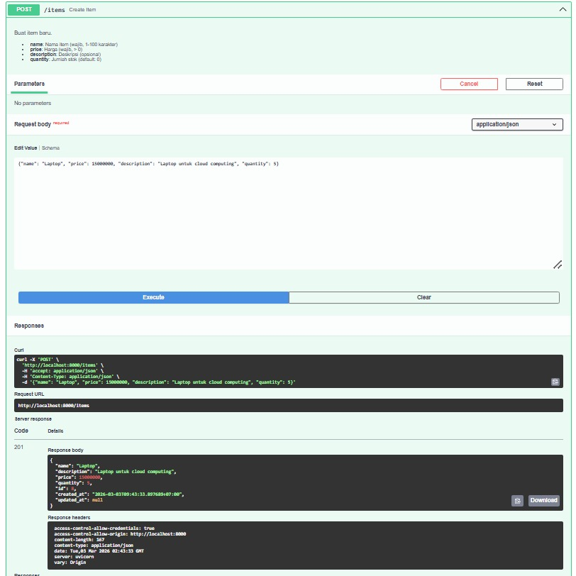

---

#### Test 2 — Buat Item: Mouse Wireless

**Request Body:**
```json
{"name": "Mouse Wireless", "price": 250000, "description": "Mouse bluetooth", "quantity": 20}
```

**cURL yang di-generate Swagger:**
```bash
curl -X 'POST' \
  'http://localhost:8000/items' \
  -H 'accept: application/json' \
  -H 'Content-Type: application/json' \
  -d '{"name": "Mouse Wireless", "price": 250000, "description": "Mouse bluetooth", "quantity": 20}'
```

**Response Code:** `201 Created`

**Response Body:**
```json
{
  "name": "Mouse Wireless",
  "description": "Mouse bluetooth",
  "price": 250000,
  "quantity": 20,
  "id": 9,
  "created_at": "2026-03-03T44:17.213007+07:00",
  "updated_at": null
}
```

**Response Headers:**
```
access-control-allow-credentials: true
access-control-allow-origin: http://localhost:8000
content-length: 161
content-type: application/json
date: Tue, 03 Mar 2026 02:44:56 GMT
server: uvicorn
vary: Origin
```

**Hasil:** ✅ PASS — Item berhasil dibuat dengan `id: 9`

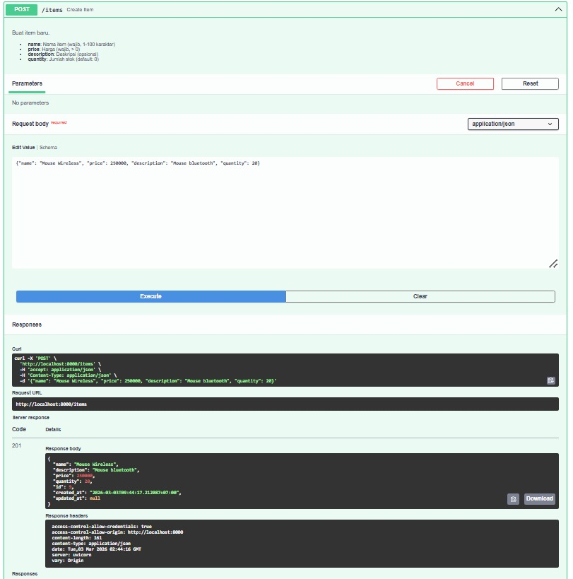

---

#### Test 3 — Buat Item: Keyboard Mechanical

**Request Body:**
```json
{"name": "Keyboard Mechanical", "price": 1200000, "description": "Keyboard untuk coding", "quantity": 8}
```

**cURL yang di-generate Swagger:**
```bash
curl -X 'POST' \
  'http://localhost:8000/items' \
  -H 'accept: application/json' \
  -H 'Content-Type: application/json' \
  -d '{"name": "Keyboard Mechanical", "price": 1200000, "description": "Keyboard untuk coding", "quantity": 8}'
```

**Response Code:** `201 Created`

**Response Body:**
```json
{
  "name": "Keyboard Mechanical",
  "description": "Keyboard untuk coding",
  "price": 1200000,
  "quantity": 8,
  "id": 10,
  "created_at": "2026-03-03T44:33.615783+07:00",
  "updated_at": null
}
```

**Response Headers:**
```
access-control-allow-credentials: true
access-control-allow-origin: http://localhost:8000
content-length: 173
content-type: application/json
date: Tue, 03 Mar 2026 02:44:36 GMT
server: uvicorn
vary: Origin
```

**Hasil:** ✅ PASS — Item berhasil dibuat dengan `id: 10`

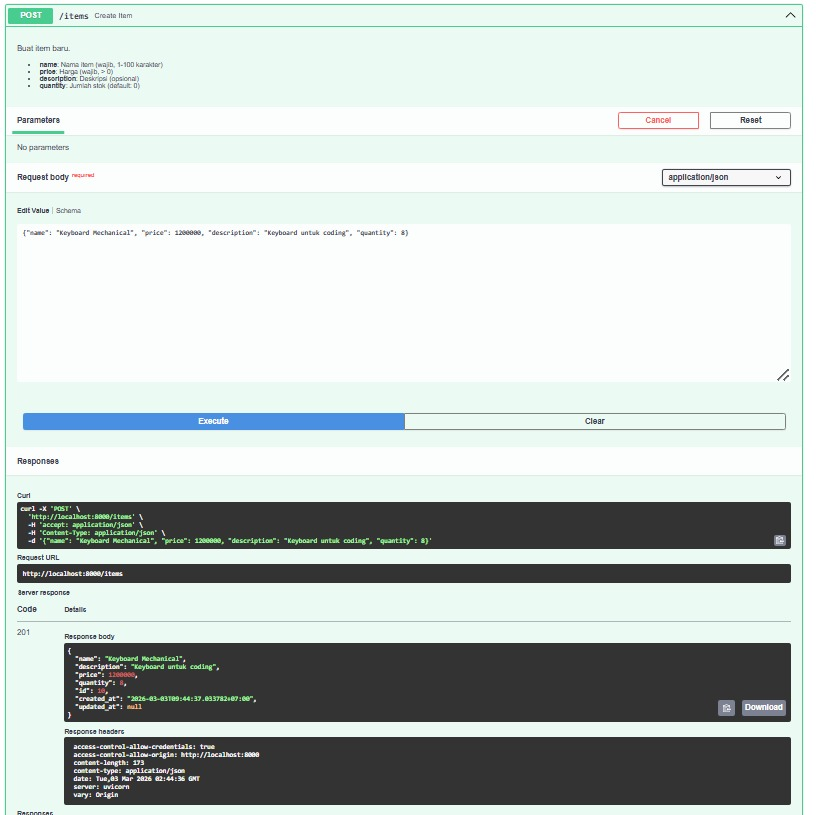

---

### Test 4–5: `GET /items` — Ambil Semua Item

---

#### Test 4 — List semua item tanpa filter

**Request URL:** `http://localhost:8000/items?skip=0&limit=20`

**cURL:**
```bash
curl -X 'GET' \
  'http://localhost:8000/items?skip=0&limit=20' \
  -H 'accept: application/json'
```

**Response Code:** `200 OK`

**Response Body:**
```json
{
  "total": 3,
  "items": [
    {
      "name": "Keyboard Mechanical",
      "description": "Keyboard untuk coding",
      "price": 1200000,
      "quantity": 8,
      "id": 10,
      "created_at": "2026-03-03T44:37.855782+07:00",
      "updated_at": null
    },
    {
      "name": "Mouse Wireless",
      "description": "Mouse bluetooth",
      "price": 250000,
      "quantity": 20,
      "id": 9,
      "created_at": "2026-03-03T44:17.213007+07:00",
      "updated_at": null
    },
    {
      "name": "Laptop",
      "description": "Laptop untuk cloud computing",
      "price": 15000000,
      "quantity": 5,
      "id": 8,
      "created_at": "2026-03-03T43:53.807688+07:00",
      "updated_at": null
    }
  ]
}
```

**Response Headers:**
```
content-length: 3337
content-type: application/json
date: Tue, 03 Mar 2026 02:46:35 GMT
server: uvicorn
```

**Hasil:** ✅ PASS — Mengembalikan 3 item dengan `total: 3`

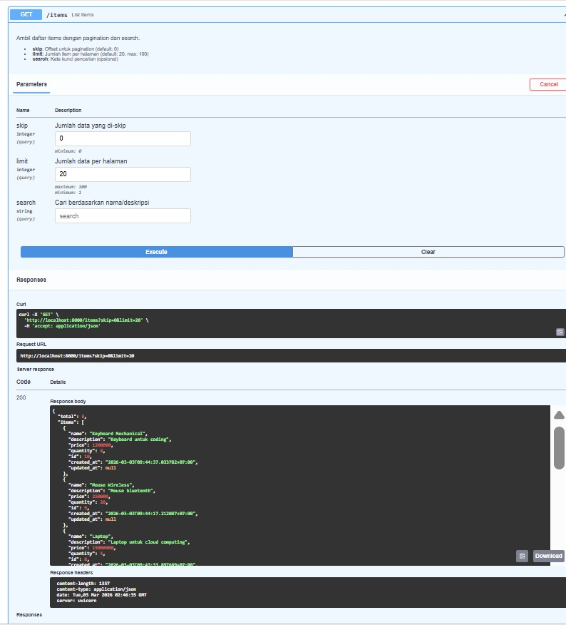

---

#### Test 5 — List item dengan search keyword "laptop"

**Request URL:** `http://localhost:8000/items?skip=0&limit=20&search=laptop`

**cURL:**
```bash
curl -X 'GET' \
  'http://localhost:8000/items?skip=0&limit=20&search=laptop' \
  -H 'accept: application/json'
```

**Response Code:** `200 OK`

**Response Body:**
```json
{
  "total": 1,
  "items": [
    {
      "name": "Laptop",
      "description": "Laptop untuk cloud computing",
      "price": 15000000,
      "quantity": 5,
      "id": 8,
      "created_at": "2026-03-03T43:55.807049+07:00",
      "updated_at": "2026-03-03T50:12.100793+07:00"
    }
  ]
}
```

**Response Headers:**
```
content-length: 318
content-type: application/json
date: Tue, 03 Mar 2026 02:53:35 GMT
server: uvicorn
```

**Hasil:** ✅ PASS — Filter search berfungsi, mengembalikan 1 item yang namanya mengandung "laptop"

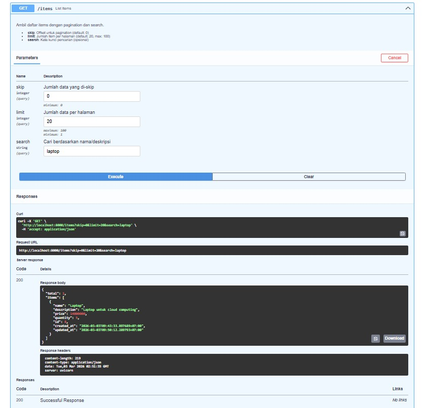

---

### Test 6–8: `GET /items/{item_id}` — Ambil Item Berdasarkan ID

---

#### Test 6 — GET item id=8 (Laptop)

**Request URL:** `http://localhost:8000/items/8`

**cURL:**
```bash
curl -X 'GET' \
  'http://localhost:8000/items/8' \
  -H 'accept: application/json'
```

**Response Code:** `200 OK`

**Response Body:**
```json
{
  "name": "Laptop",
  "description": "Laptop untuk cloud computing",
  "price": 15000000,
  "quantity": 5,
  "id": 8,
  "created_at": "2026-03-03T43:33.897688+07:00",
  "updated_at": null
}
```

**Response Headers:**
```
content-length: 167
content-type: application/json
date: Tue, 03 Mar 2026 02:47:40 GMT
server: uvicorn
```

**Hasil:** ✅ PASS — Data Laptop berhasil diambil

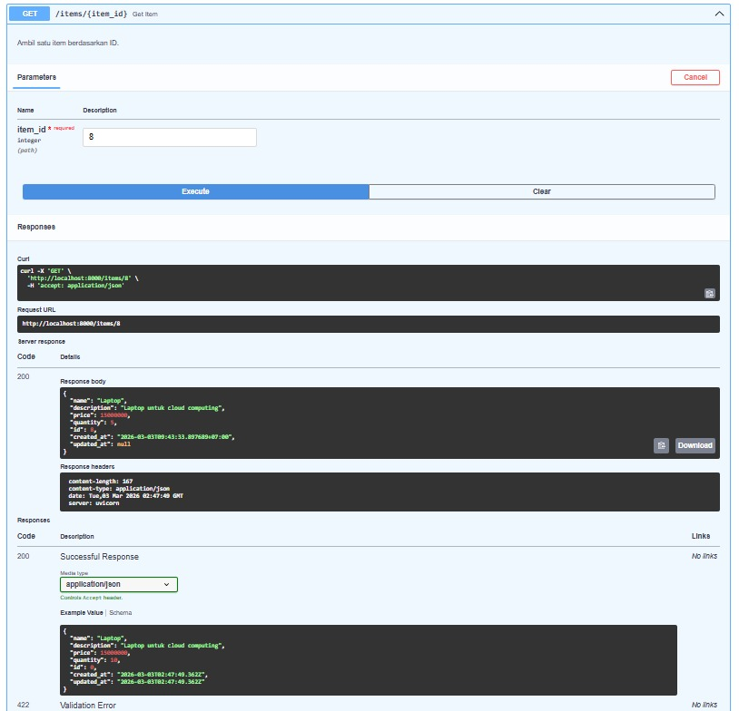

---

#### Test 7 — GET item id=9 (Mouse Wireless)

**Request URL:** `http://localhost:8000/items/9`

**cURL:**
```bash
curl -X 'GET' \
  'http://localhost:8000/items/9' \
  -H 'accept: application/json'
```

**Response Code:** `200 OK`

**Response Body:**
```json
{
  "name": "Mouse Wireless",
  "description": "Mouse bluetooth",
  "price": 250000,
  "quantity": 20,
  "id": 9,
  "created_at": "2026-03-03T44:17.213007+07:00",
  "updated_at": null
}
```

**Response Headers:**
```
content-length: 161
content-type: application/json
date: Tue, 03 Mar 2026 02:48:03 GMT
server: uvicorn
```

**Hasil:** ✅ PASS — Data Mouse Wireless berhasil diambil

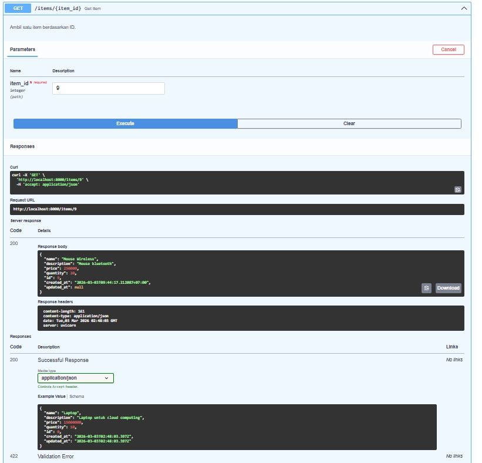

---

#### Test 8 — GET item id=10 (Keyboard Mechanical)

**Request URL:** `http://localhost:8000/items/10`

**cURL:**
```bash
curl -X 'GET' \
  'http://localhost:8000/items/10' \
  -H 'accept: application/json'
```

**Response Code:** `200 OK`

**Response Body:**
```json
{
  "name": "Keyboard Mechanical",
  "description": "Keyboard untuk coding",
  "price": 1200000,
  "quantity": 8,
  "id": 10,
  "created_at": "2026-03-03T44:37.853782+07:00",
  "updated_at": null
}
```

**Response Headers:**
```
content-length: 173
content-type: application/json
date: Tue, 03 Mar 2026 02:48:16 GMT
server: uvicorn
```

**Hasil:** ✅ PASS — Data Keyboard Mechanical berhasil diambil

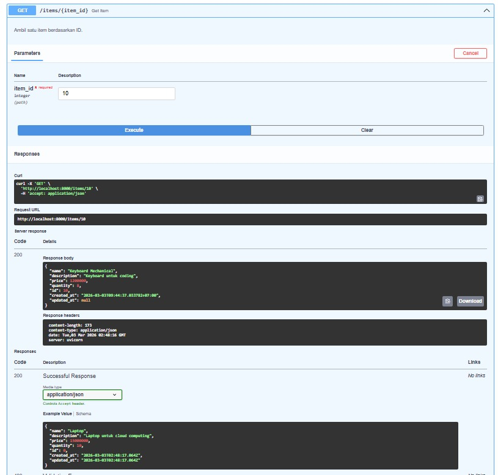

---

### Test 9: `PUT /items/{item_id}` — Update Item

---

#### Test 9 — Update Laptop (id=8): ubah harga menjadi 14000000

**Request URL:** `http://localhost:8000/items/8`

**cURL:**
```bash
curl -X 'PUT' \
  'http://localhost:8000/items/8' \
  -H 'accept: application/json' \
  -H 'Content-Type: application/json' \
  -d '{
    "name": "Laptop",
    "description": "Laptop untuk cloud computing",
    "price": 14000000,
    "quantity": 5
  }'
```

**Request Body:**
```json
{
  "name": "Laptop",
  "description": "Laptop untuk cloud computing",
  "price": 14000000,
  "quantity": 5
}
```

**Response Code:** `200 OK`

**Response Body:**
```json
{
  "name": "Laptop",
  "description": "Laptop untuk cloud computing",
  "price": 14000000,
  "quantity": 5,
  "id": 8,
  "created_at": "2026-03-03T43:55.807049+07:00",
  "updated_at": "2026-03-03T50:13.100793+07:00"
}
```

**Response Headers:**
```
access-control-allow-credentials: true
access-control-allow-origin: http://localhost:8000
content-length: 397
content-type: application/json
date: Tue, 03 Mar 2026 02:50:21 GMT
server: uvicorn
vary: Origin
```

**Hasil:** ✅ PASS — `price` berhasil diubah dari `15000000` → `14000000`, field `updated_at` kini terisi timestamp

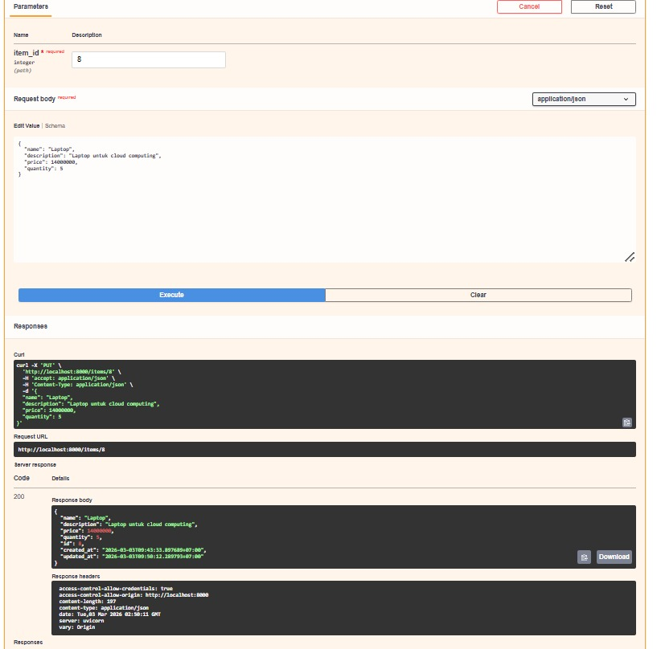

---

### Test 10: Verifikasi Data Setelah Update

---

#### Test 10 — GET item id=8 setelah PUT

**Request URL:** `http://localhost:8000/items/8`

**Response Code:** `200 OK`

**Response Body:**
```json
{
  "name": "Laptop",
  "description": "Laptop untuk cloud computing",
  "price": 14000000,
  "quantity": 5,
  "id": 8,
  "created_at": "2026-03-03T43:33.897688+07:00",
  "updated_at": "2026-03-03T50:12.100795+07:00"
}
```

**Hasil:** ✅ PASS — Harga terkonfirmasi berubah menjadi `14000000` dan `updated_at` terisi

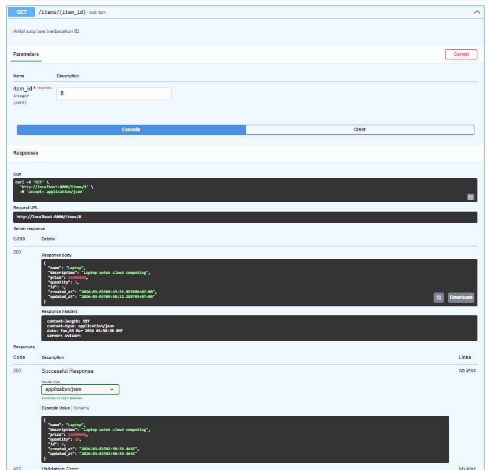

---

### Test 11: `GET /items/stats` — Statistik Inventori

---

#### Test 11 — Cek statistik (kondisi: 3 item tersedia, Laptop sudah diupdate)

**Request URL:** `http://localhost:8000/items/stats`

**cURL:**
```bash
curl -X 'GET' \
  'http://localhost:8000/items/stats' \
  -H 'accept: application/json'
```

**Response Code:** `200 OK`

**Response Body:**
```json
{
  "total_items": 2,
  "total_value": 14600000,
  "most_expensive": {
    "name": "Keyboard Mechanical",
    "price": 1200000
  },
  "cheapest": {
    "name": "Mouse Wireless",
    "price": 250000
  }
}
```

**Response Headers:**
```
content-length: 142
content-type: application/json
date: Wed, 04 Mar 2026 14:54:08 GMT
server: uvicorn
```

**Hasil:** ✅ PASS — Statistik sesuai kondisi database saat itu: `total_items: 2` (setelah Laptop dihapus), `most_expensive` adalah Keyboard Mechanical, `cheapest` adalah Mouse Wireless

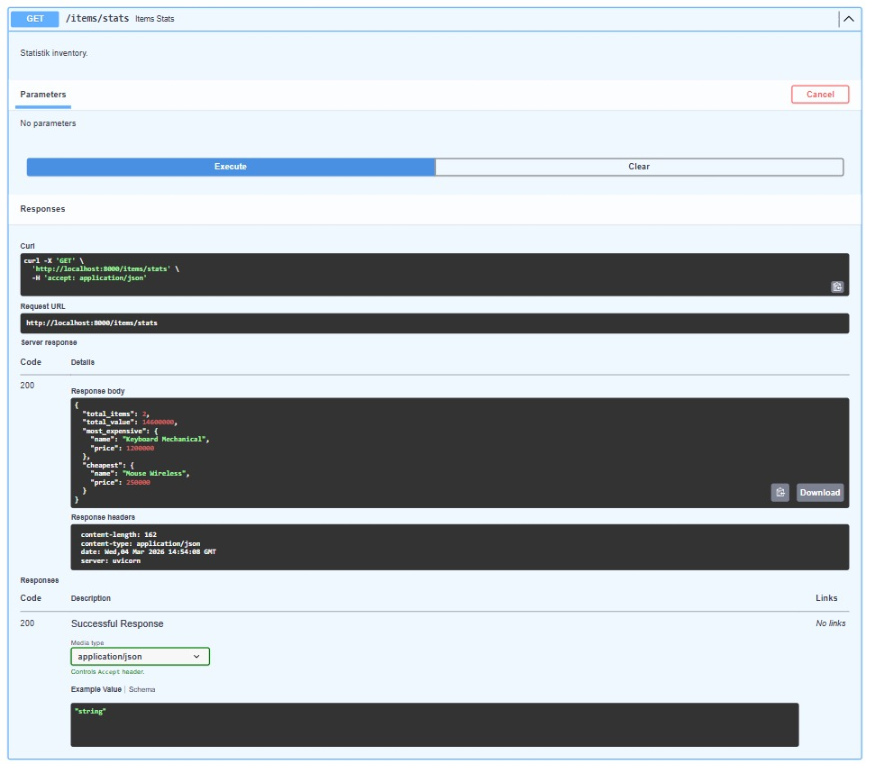

---

### Test 12: `DELETE /items/{item_id}` — Hapus Item

---

#### Test 12 — Hapus Laptop (id=8)

**Request URL:** `http://localhost:8000/items/8`

**cURL:**
```bash
curl -X 'DELETE' \
  'http://localhost:8000/items/8' \
  -H 'accept: */*'
```

**Response Code:** `204 No Content`

**Response Body:**
```
(kosong)
```

**Response Headers:**
```
access-control-allow-credentials: true
access-control-allow-origin: http://localhost:8000
content-type: application/json
date: Tue, 03 Mar 2026 02:53:53 GMT
server: uvicorn
vary: Origin
```

**Hasil:** ✅ PASS — Item berhasil dihapus, response body kosong sesuai konvensi `204 No Content`

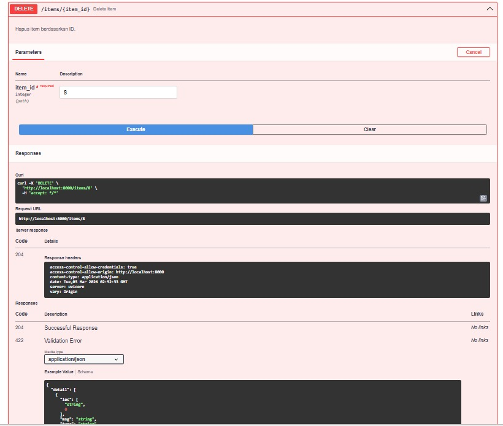

---

### Test 13: Verifikasi Data Setelah DELETE

---

#### Test 13 — GET item id=8 setelah dihapus

**Request URL:** `http://localhost:8000/items/8`

**Response Code:** `404 Not Found`

**Response Body:**
```json
{
  "detail": "Item dengan id=8 tidak ditemukan"
}
```

**Hasil:** ✅ PASS — Server mengembalikan `404` setelah item dihapus, membuktikan data benar-benar terhapus dari database

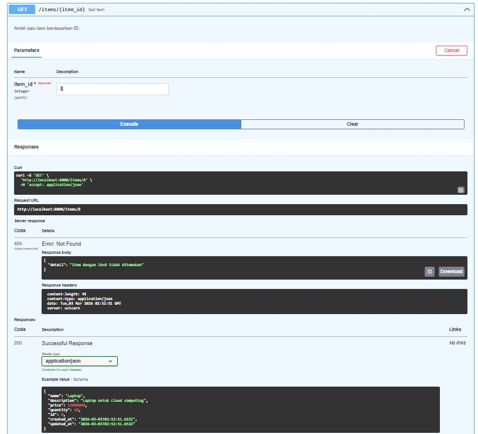

---

### Test 14: `GET /team` — Informasi Tim

---

#### Test 14 — Ambil data tim

**Request URL:** `http://localhost:8000/team`

**cURL:**
```bash
curl -X 'GET' \
  'http://localhost:8000/team' \
  -H 'accept: application/json'
```

**Response Code:** `200 OK`

**Response Body:**
```json
{
  "team": "cloud-team-XX",
  "members": [
    {"name": "Andini Permata Dewanti", "nim": "10231014", "role": "Lead Backend"},
    {"name": "Putri Rahmawati",        "nim": "10231074", "role": "Lead Frontend"},
    {"name": "Krishandy Dhanysa Pratama", "nim": "10231050", "role": "Lead DevOps"},
    {"name": "Desnita Dwi Putri",      "nim": "10231030", "role": "Lead QA & Docs"}
  ]
}
```

**Response Headers:**
```
content-length: 321
content-type: application/json
date: Sun, 08 Mar 2026 03:19:54 GMT
server: uvicorn
```

**Hasil:** ✅ PASS — Data tim lengkap berhasil dikembalikan

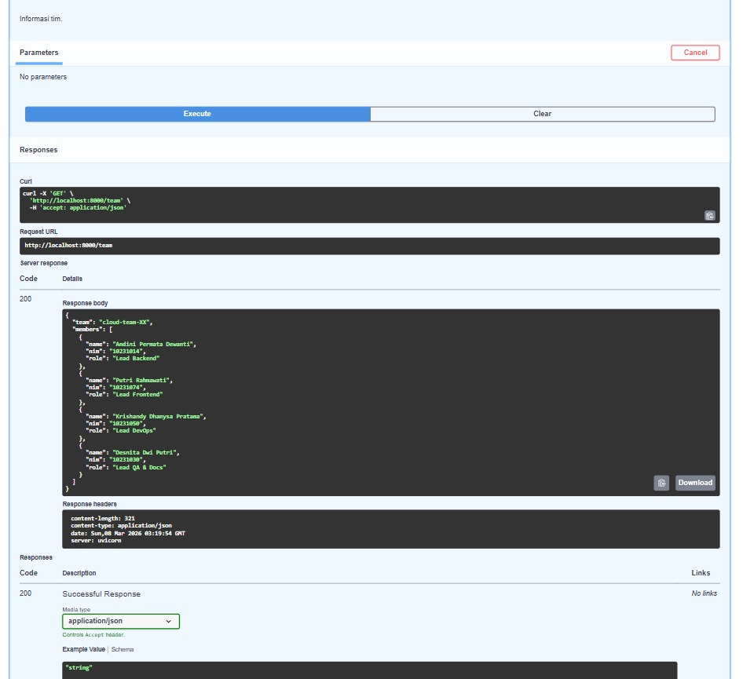

---

## 📝 Catatan Testing

- Semua endpoint diuji secara berurutan untuk mensimulasikan alur penggunaan nyata: **buat → baca → update → verifikasi → hapus → verifikasi**
- Testing dilakukan via **Swagger UI** (`/docs`) yang otomatis di-generate oleh FastAPI
- Server berjalan di `http://localhost:8000` dengan `uvicorn main:app --reload`
- Database PostgreSQL sudah berjalan di `localhost:5432`, database `cloudapp`
- Semua response menggunakan format `application/json`
- Timezone pada timestamp menggunakan `+07:00` (WIB)

---