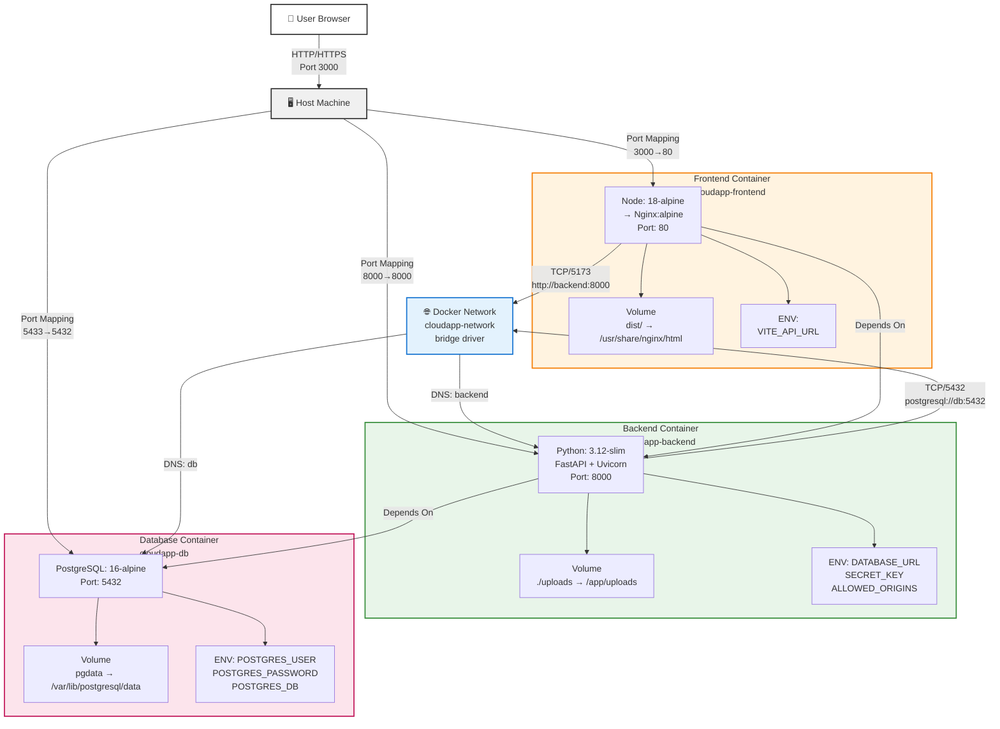
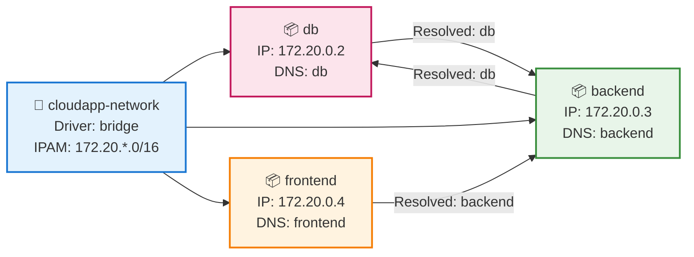
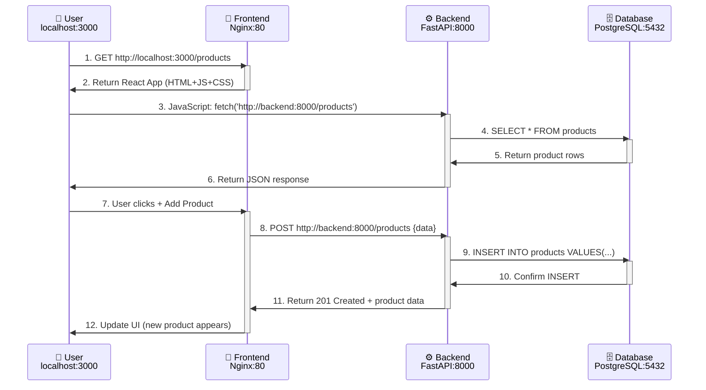
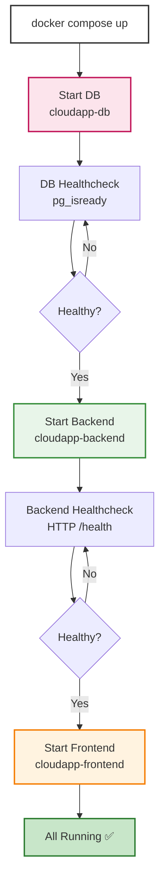
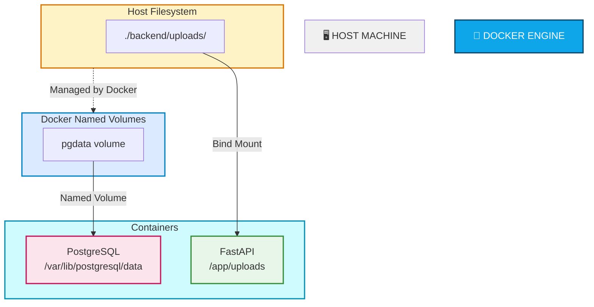

# 🐳 Docker Architecture — ATHSNAC Platform

## 📐 Arsitektur Overview

**Apa itu Docker Container?**
Container adalah "komputer mini" yang menjalankan aplikasi dalam lingkungan terisolasi. Setiap container memiliki OS mini, library, dan aplikasi sendiri. Ini seperti membawa rumah portabel yang sama di mana pun Anda pergi.

**ATHSNAC Platform Architecture:**
ATHSNAC platform tersusun dari **3 container utama** yang saling terintegrasi melalui Docker network bridge. Setiap container memiliki peran spesifik dalam ekosistem aplikasi:

1. **Database Container** (🗄️ PostgreSQL) - Menyimpan data produk, order, user, pembayaran
2. **Backend Container** (⚙️ FastAPI) - Proses bisnis, API endpoints, authentication
3. **Frontend Container** (🎨 React+Nginx) - Interface yang dilihat pelanggan

Estibalnya: Backend bertanya ke Database untuk data, Frontend menampilkan data ke user, user mengirim request ke Backend.

```
┌─────────────────────────────────────────────────────────────┐
│                    HOST MACHINE                              │
│                                                               │
│  Port: 3000 ◄────────────────────────────────────────────┐  │
│  Port: 8000 ◄────────────────────────────────────────────┤──┤  │
│  Port: 5433 ◄────────────────────────────────────────────┤  │  │
│                                                           │  │  │
│  ┌─────────────────────────────────────────────────────┐ │  │  │
│  │         cloudapp-network (Bridge Driver)            │ │  │  │
│  │                                                      │ │  │  │
│  │  ┌──────────────┐  ┌──────────────┐  ┌───────────┐ │ │  │  │
│  │  │ PostgreSQL   │  │  FastAPI     │  │  React +  │ │ │  │  │
│  │  │ 16-alpine    │  │  Backend     │  │  Nginx    │ │ │  │  │
│  │  │ :5432        │  │  :8000       │  │  :80      │ │ │  │  │
│  │  │  cloudapp-db │  │cloudapp-bck  │  │cloudapp-fr│ │ │  │  │
│  │  └──────────────┘  └──────────────┘  └───────────┘ │ │  │  │
│  │         │                  │                │       │ │  │  │
│  │         └──────────────────┼────────────────┘       │ │  │  │
│  │                           DNS                       │ │  │  │
│  │                                                      │ │  │  │
│  └──────────────────────────────────────────────────────┘ │  │  │
│                        ▲                                   │  │  │
│                        └───────────────────────────────────┘  │  │
│                                                                 │  │
│  ┌────────────────────────────────────────────────────────┐   │  │
│  │           VOLUMES (Persistent Storage)                │   │  │
│  │                                                         │   │  │
│  │  pgdata: /var/lib/postgresql/data                      │   │  │
│  │  uploads: ./backend/uploads → /app/uploads            │   │  │
│  └────────────────────────────────────────────────────────┘   │  │
│                                                                 │  │
└─────────────────────────────────────────────────────────────────┘
```

---

## 🏗️ Diagram Arsitektur Interaksi (Mermaid)



---

## 📦 Container Specifications

### 1️⃣ Database Container — PostgreSQL

#### Metadata
```yaml
Container Name: cloudapp-db
Image: postgres:16-alpine
Restart Policy: unless-stopped
Network: cloudapp-network
Healthcheck: Active (pg_isready)
```

#### Network Configuration

**Apa itu Port?**
Port seperti pintu rumah. Komputer punya banyak pintu (port) untuk komunikasi. Port 5432 adalah pintu default PostgreSQL. Port 3000 adalah pintu frontend kita.

**Port Mapping:**
- Port internal container dapat berbeda dari port host
- Contoh: Database dengar di port 5432 (internal), tapi dari luar kita akses lewat port 5433 (external)

| Aspect | Value | Details |
|--------|-------|---------|
| **Container Port** | 5432 | PostgreSQL default port (dibuka di dalam Docker network) |
| **Host Port** | 5433 | Exposed on host machine (port yang bisa diakses dari kompi lokal) |
| **Network Mode** | bridge (cloudnet) | Internal DNS: `db` (container lain panggil cukup "db", Docker resolve) |
| **Hostname** | db | Used by other containers (nama container di network) |

#### Environment Variables

**Apa itu Environment Variable?**
Environment variable adalah "konfigurasi" yang bisa berubah tanpa edit code. Seperti setting di ponsel - Anda bisa ganti bahasa tanpa format ulang.

```bash
# Database Credentials (Bisa diganti tanpa code change)
POSTGRES_USER=postgres
POSTGRES_PASSWORD=postgres123
POSTGRES_DB=cloudapp
```

**Penjelasan setiap variable:**
- `POSTGRES_USER`: Admin username untuk database (username login database)
- `POSTGRES_PASSWORD`: Admin password (⚠️ Change in production! Jangan gunakan password sederhana di production)
- `POSTGRES_DB`: Initial database yang akan dibuat saat startup (database name yang di-create otomatis)

#### Volumes

**Apa itu Volume?**
Volume adalah "folder ajaib" yang terhubung antara container dan host machine. Data di folder ini persisten (tidak hilang saat container stop).

Anologi: Jika container diibaratkan rumah, volume adalah brankas yang terhubung ke rumah. Meskipun rumah rubuh, brankas tetap aman.

```yaml
pgdata:                                  # Named volume
  Host Path: docker volume (managed by Docker)
  Container Path: /var/lib/postgresql/data
  Persistence: Database files disimpan di host
  Backup: Easy to backup dengan docker volume commands
```

**Volume Purpose:**
- Persist data ketika container stop/restart
- Data tidak hilang saat `docker compose down` (data tetap ada)
- Backup dapat dilakukan dengan `docker volume inspect pgdata`
- PostgreSQL file tersimpan di volume ini, auto-recover setelah restart

#### Healthcheck

**Apa itu Healthcheck?**
Healthcheck adalah "test kesehatan" yang Docker jalankan berkala. Seperti dokter check tanda vital pasien - dokter ingin tahu apakah jantung masih berdetak, tekanan darah normal, dll.

Jika container "sakit" (healthcheck fail), Docker bisa otomatis restart untuk menyembuhkannya.

```bash
test: ["CMD-SHELL", "pg_isready -U postgres -d cloudapp"]
# ↑ Jalankan perintah: cek apakah PostgreSQL siap menerima koneksi
interval: 10s           # Check every 10 seconds (interval pemeriksaan)
timeout: 5s             # Wait max 5 seconds for response (timeout respond)
retries: 5              # Fail after 5 failed checks (sebelum mark unhealthy)
start_period: 10s       # Grace period saat startup (abaikan fail saat startup)
```

**Behavior:**
- Docker jalankan `pg_isready` setiap 10 detik
- Jika response OK dalam 5 detik → Healthcheck passed ✅
- Jika fail 5x berturut-turut → Container marked unhealthy ❌
- Backend akan tunggu Database healthy sebelum start (prevent connection errors saat database masih booting up)

---

### 2️⃣ Backend Container — FastAPI

#### Metadata
```yaml
Container Name: cloudapp-backend
Image: python:3.12-slim (custom built)
Build Context: ./backend/Dockerfile
Restart Policy: unless-stopped
Network: cloudapp-network
Depends On: db (service_healthy)
Healthcheck: Active (HTTP /health)
User: appuser (non-root, security best practice)
```

#### Network Configuration

| Aspect | Value | Details |
|--------|-------|---------|
| **Container Port** | 8000 | Uvicorn default port (backend listen di port 8000 internal) |
| **Host Port** | 8000 | Same as container (no mapping needed) - akses dari host: localhost:8000 |
| **Network Mode** | bridge (cloudnet) | Internal DNS: `backend` (container lain panggil "backend") |
| **Hostname** | backend | Can be resolved by other containers (nama DNS internal) |

#### Environment Variables

**Apa itu Environment Variable?**
Environment variable adalah "konfigurasi" yang bisa berubah tanpa edit code. Seperti setting di ponsel - Anda bisa ganti bahasa tanpa format ulang.

File: `.env.docker`

```bash
# Database Connection (Container DNS: db)
DATABASE_URL=postgresql://postgres:postgres123@db:5432/cloudapp
#              ↑                                  ↑
#              username:password                hostname (container name in network)

# JWT Configuration (Token handling - untuk session management)
SECRET_KEY=670bf616568fd448e61e627212941e5957919a6459ff10a115979780b15952bb
#          ↑ Secret key super penting untuk encrypt/decrypt token
ALGORITHM=HS256                    # Token algorithm (HS256 = HMAC SHA-256)
ACCESS_TOKEN_EXPIRE_MINUTES=60     # Token berlaku 60 menit, setelah itu user harus login lagi

# CORS Configuration (Allow frontend origin - security)
ALLOWED_ORIGINS=http://localhost:3000,http://localhost:5173
#                 ↑ Container DNS     ↑ Dev server Vite
#  CORS = Cross-Origin Resource Sharing
#  Ini list domain yang boleh akses API (block request dari domain lain)
```

**Critical Notes - Penjelasan Mendalam:**
- `db:5432`: Container DNS resolution 
  - Backend bisa akses database hanya dengan mengetik nama "db"
  - Docker network otomatis resolve "db" → IP address database (172.20.0.2)
  - Jika pakai IP hardcoded, container restart IP berubah → connection error
  
- `SECRET_KEY`: Must be long & random (use env var, not hardcoded!)
  - Untuk encrypt JWT token user
  - Token: {"user": "admin", "exp": 1234567} → encrypt dengan SECRET_KEY → eyJhbGc...
  - Jika terbongkar, hacker bisa forge token, semua user bisa masuk tanpa password ❌
  - MUST regenerate di production! Jangan copy dari dev
  
- `ACCESS_TOKEN_EXPIRE_MINUTES=60`: Token berlaku 60 menit
  - Saat user login, dapat token yang berlaku sampai 60 menit
  - Setelah 60 menit, token expire, user harus login lagi
  - Ini keamanan: jika token dicuri hacker, dia hanya bisa pakai 60 menit, bukan selamanya
  
- `ALLOWED_ORIGINS`: Whitelist frontend origins to prevent CORS attacks
  - Hanya allow React app dengan origin `http://localhost:3000` dan `http://localhost:5173`
  - Jika website jahat (http://hacker.com) coba akses API → CORS reject ❌
  - Ini proteksi browser untuk prevent cross-site attacks

#### Volumes

**Apa itu Volume?**
Volume adalah "folder ajaib" yang terhubung antara container dan host machine. Data di folder ini persisten (tidak hilang saat container stop).

Anologi: Jika container diibaratkan rumah, volume adalah brankas yang terhubung ke rumah. Meskipun rumah rubuh, brankas tetap aman.

```yaml
Backend Uploads:
  Host Path: ./backend/uploads
  Container Path: /app/uploads
  Type: Bind volume (direct directory mapping)
  Purpose: Store user-uploaded files persistently
```

**File Mapping Example (Visualisasi):**
```
Host Machine                    Docker Container
./backend/uploads/  ◄────────► /app/uploads/
  ├── nastar.jpg               ├── nastar.jpg
  ├── amplang.jpg              ├── amplang.jpg
  └── abon.jpg                 └── abon.jpg
```

#### Healthcheck

**Apa itu Healthcheck?**
Healthcheck adalah "test kesehatan" yang Docker jalankan berkala. Seperti dokter check tanda vital pasien - dokter ingin tahu apakah jantung masih berdetak, tekanan darah normal, dll.

Jika container "sakit" (healthcheck fail), Docker bisa otomatis restart untuk menyembuhkannya.

```bash
test: ["CMD", "python", "-c", "import urllib.request; urllib.request.urlopen('http://localhost:8000/health')"]
#      ↑ Jalankan perintah Python: send HTTP GET request ke /health endpoint
interval: 30s          # Check every 30 seconds (healthcheck jalankan setiap 30 detik)
timeout: 10s           # Wait max 10 seconds (max tunggu response 10 detik)
retries: 3             # Fail after 3 failed checks (fail 3x berturut-turut → mark unhealthy)
start_period: 15s      # Grace period saat startup (abaikan fail selama 15 detik pertama startup)
```

**What It Does - Bagaimana Prosesnya:**
- Docker jalankan Python script setiap 30 detik
- Script send HTTP request: `GET http://localhost:8000/health`
- Backend respons dengan status code:
  - **2xx (200-299)**: Healthy ✅ - Semuanya baik
  - **5xx (500-599)**: Unhealthy ❌ - Backend crash atau error
- Jika response 2xx dalam 10 detik → Test passed
- Jika timeout 10 detik atau response error → Test failed
- Setelah fail 3x → Container marked as "unhealthy"
- Docker dashboard show container unhealthy (operator tahu ada problem)

**Scenario:**
- Startup container: Grace period 15s (abaikan fail saat startup, tunggu app initialize)
- Startup sukses: Respond 200 OK → healthy status ✅
- App crash atau error: Response 500 error → fail 3x → unhealthy ❌
- Frontend bisa detect backend unhealthy, show error message ke user

#### Dockerfile (Multi-layer Optimization)

**Apa itu Dockerfile?**
Dockerfile adalah "resep" untuk membuat image Docker. Seperti resep masakan - Anda listing bahan, langkah demi langkah. Docker mengikuti resep ini untuk build image.

**Multi-layer Optimization:**
Setiap perintah di Dockerfile membuat "layer" (lapisan). Docker cache layer ini:
- Jika Anda ubah kode tapi tidak ubah `requirements.txt`, Docker skip ulang install dependency (lebih cepat)
- Ini hemat waktu development

```dockerfile
# Layer 1: Base image
FROM python:3.12-slim

# Layer 2: Working directory
WORKDIR /app

# Layer 3: Copy requirements (cache optimization)
COPY requirements.txt .

# Layer 4: Install dependencies (cache layer)
RUN pip install --no-cache-dir -r requirements.txt
#   ↑ --no-cache-dir = reduce image size

# Layer 5: Copy source code
COPY . .

# Layer 6: Security hardening
RUN useradd -m appuser && chown -R appuser /app
USER appuser
#   ↑ Non-root user = security best practice

# Layer 7: Expose port
EXPOSE 8000

# Layer 8: Run command
CMD ["uvicorn", "main:app", "--host", "0.0.0.0", "--port", "8000"]
```

**Benefits:**
- Use `python:3.12-slim` (170 MB) instead of full (920 MB) - Image kecil = Download cepat, start cepat, hemat storage
- Layer caching: Requirements layer reused if not changed - Jika requirements tidak berubah, Docker skip re-install (hemat waktu)
- Non-root user prevents privilege escalation attacks - Hacker lebih sulit akses host machine jika container disusupi

---

### 3️⃣ Frontend Container — React + Nginx

#### Metadata
```yaml
Container Name: cloudapp-frontend
Image: nginx:alpine (runtime)
Build Context: ./frontend/Dockerfile (multi-stage)
Build Stage 1: node:18-alpine (build)
Build Stage 2: nginx:alpine (runtime)
Restart Policy: unless-stopped
Network: cloudapp-network
Depends On: backend
```

#### Network Configuration

| Aspect | Value | Details |
|--------|-------|---------|
| **Container Port** | 80 | HTTP standard port |
| **Host Port** | 3000 | Custom mapping (for dev compatibility) |
| **Network Mode** | bridge (cloudnet) | Internal DNS: `frontend` |
| **Hostname** | frontend | Can be resolved by other containers |

#### Build Arguments & Environment

**Apa itu Build Arguments?**
Build Arguments adalah parameter yang bisa berubah SAAT BUILD TIME (bukan runtime). Seperti template variable - Anda bisa inject nilai berbeda saat build tanpa ubah Dockerfile.

```dockerfile
# Build Time Arguments (Baked into build)
ARG VITE_API_URL=http://localhost:8000
#   ↑ Default value jika tidak provide saat build
#   ↑ VITE_API_URL = dari mana Frontend connect ke Backend API
ENV VITE_API_URL=$VITE_API_URL
#   ↑ Copy ARG ke ENV variable
#   ↑ Embedded dalam JavaScript bundle saat npm build
```

**Proses Dari Perspektif Frontend:**
```
Frontend Code:
  const API_URL = process.env.VITE_API_URL;  // http://localhost:8000
  const response = await fetch(`${API_URL}/products`);

Saat build:
  npm build → Inject VITE_API_URL → JavaScript bundle
  dist/index.html: <script> const API_URL = 'http://localhost:8000'; </script>

Result:
  Frontend punya URL backend di-hard-code dalam JavaScript
  Frontend bisa connect ke Backend tanpa query config
```

**Docker Compose Override:**
```yaml
frontend:
  build:
    args:
      VITE_API_URL: http://localhost:8000  # Can be overridden di production
      #              ↑ Bisa ganti ke production URL: https://api.athsnac.com
```

**Use Case:**
- **Development:** `http://localhost:8000` (local backend)
- **Production:** `https://api.athsnac.com` (production backend URL)
- Change hanya di docker-compose.yml, tidak perlu change frontend code

#### Volumes

```yaml
Frontend Build Output:
  Host Path: None (embedded dalam image)
  Container Path: /usr/share/nginx/html
  Type: Embedded in Docker image layers
  Purpose: Serve built React app
```

**Explanation:**
- React app di-build ke `/app/dist/` saat build time
- File di-copy ke Nginx container (`/usr/share/nginx/html`)
- Files tidak perlu di-sync dengan host (production-optimized)

#### Dockerfile (Multi-stage Build)

**Apa itu Multi-stage Build?**
Multi-stage build adalah teknik membuat 2 container sementara:
1. **Stage 1 (builder):** Container pertama untuk compile/build code (butuh tools besar) → remove setelah build
2. **Stage 2 (runtime):** Container kedua untuk jalankan hasil build (hanya butuh requirements kecil)

Anologi: Pabrik mobil - butuh mesin berat untuk fabrikasi (stage 1), tapi mobil final tidak perlu semua mesin itu (stage 2). 

Hasil: Image final bisa 10x lebih kecil!

```dockerfile
# ============ STAGE 1: Build ============
FROM node:18-alpine AS builder

WORKDIR /app
COPY package.json package-lock.json ./

# Clean install (reproducible builds)
RUN npm ci

COPY . .

# Build args passed saat docker build
ARG VITE_API_URL=http://localhost:8000
ENV VITE_API_URL=$VITE_API_URL

# Build → creates /app/dist/
RUN npm run build
# Result: Static files ready to serve


# ============ STAGE 2: Runtime ============
FROM nginx:alpine

# Copy build output dari stage 1
COPY --from=builder /app/dist /usr/share/nginx/html

# Copy Nginx config
COPY nginx.conf /etc/nginx/conf.d/default.conf

# Expose port
EXPOSE 80

# Start Nginx
CMD ["nginx", "-g", "daemon off;"]
```

**Multi-stage Benefits dengan Angka Konkret:**
- **Stage 1 (builder):** 500+ MB (Node, npm, webpack, TypeScript compiler, build tools)
- **Stage 2 (runtime):** ~15 MB (Nginx only)
- **Final image size:** ~50-100 MB (vs 500+ MB if single stage)
- **Hasil:** Deploy lebih cepat ke production, lebih hemat bandwidth

#### Nginx Configuration

**Apa itu Nginx?**
Nginx adalah "web server" - aplikasi yang serve file statis (HTML, CSS, JS) ke browser. Nginx juga bisa act sebagai proxy (teruskan request ke backend).

File: `nginx.conf`

```nginx
server {
    listen 80;                           # Nginx listen di port 80 (HTTP standard)
    server_name localhost;
    root /usr/share/nginx/html;          # Folder dimana file HTML/JS/CSS disimpan
    index index.html;                    # File default yang di-serve jika akses /

    # SPA routing: All routes → index.html
    # Prevents 404 on page refresh (React Router handles routing di client-side)
    location / {
        try_files $uri $uri/ /index.html;
        # Proses: Browser request /products → cek apakah file products exists di disk
        #         - Jika file exists (static file) → serve file ✅
        #         - Jika tidak exists (route) → serve /index.html → React Router handle ✅
        #         Ini biar React bisa handle client-side routing (React Router)
    }

    # Cache static assets (1 year)
    location ~* \\.(js|css|png|jpg|jpeg|gif|ico|svg|woff|woff2)$ {
        # ~* = regex case-insensitive, \\. = literal dot
        # Ini match: app.js, style.css, logo.png, font.woff, dll
        expires 1y;                      # Tell browser cache 1 year (very long)
        add_header Cache-Control "public, immutable";
        # Implication: Browser download file sekali, re-use dari cache
        #              Tidak perlu download ulang setiap kali refresh
        #              Hemat bandwidth & faster loading
    }

    # Don't cache index.html (always fetch latest)
    location = /index.html {             # = exact match /index.html
        add_header Cache-Control "no-cache";
        # Implication: Browser TIDAK cache index.html
        #              Setiap kali visit, browser fetch latest index.html
        #              Ini penting karena app version bisa update, index.html ref file baru
    }
}
```

**Configuration Explanation - Bagaimana Cara Kerja:**
- Browser request `GET /products`:
  1. Nginx cek: apakah file `/usr/share/nginx/html/products` exists? Tidak
  2. Nginx apply rule: `try_files $uri $uri/ /index.html` → serve `/index.html`
  3. Browser dapat `/index.html` file (React app)
  4. React Router di browser parse URL `/products` → load Products page
  
- Browser request `GET /app.js` (static file):
  1. Nginx cek: file exists? Ya
  2. Nginx serve file dari disk
  3. Nginx set header: `Cache-Control: public, immutable`
  4. Browser cache file 1 year
  
- Browser refresh: request `/`:
  1. Nginx serve `/index.html`
  2. Header: `Cache-Control: no-cache`
  3. Browser fetch latest dari server (tidak pakai cache version)
    location ~* \.(js|css|png|jpg|jpeg|gif|ico|svg|woff|woff2)$ {
        expires 1y;
        add_header Cache-Control "public, immutable";
    }

    # Don't cache index.html
    location = /index.html {
        add_header Cache-Control "no-cache";
    }
}
```

**Configuration Explanation:**
- `try_files $uri $uri/ /index.html`: SPA routing (React Router)
- `expires 1y`: Browser cache static assets for 1 year
- `no-cache` for index.html: Always fetch latest from server

---

## 🌐 Network Architecture

**Apa itu Docker Network?**
Docker Network adalah komunikasi internal antar container. Seperti jaringan rumah (WiFi) - device dalam rumah bisa saling bicara.

Bridge network: Container connected ke virtual switch, mereka bisa saling komunikasi dengan hostname (nama container).

### Docker Network: `cloudapp-network`



### DNS Resolution (Internal)

**Apa itu DNS Resolution?**
DNS adalah "phonebook" internet. Ketika Anda ketik "google.com", DNS resolve menjadi IP address (1.2.3.4).

Docker punya DNS internal sendiri - container bisa cari container lain hanya pakai nama, Docker resolve otomatis ke IP.

| Service | Container Name | DNS Resolution | Port |
|---------|-----------------|---|------|
| Database | cloudapp-db | `db` | 5432 |
| Backend | cloudapp-backend | `backend` | 8000 |
| Frontend | cloudapp-frontend | `frontend` | 80 |

**Example - Bagaimana Backend Connect ke Database:**
```python
# Code: DATABASE_URL=postgresql://postgres:postgres123@db:5432/cloudapp
#                                    ↑
#                        Cukup ketik nama "db"

# Resolution process (automatic):
# 1. FastAPI di backend container coba connect ke hostname "db"
# 2. Docker network DNS melihat query, resolve: "db = 172.20.0.2 (IP DB container)"
# 3. Koneksi established dari 172.20.0.3:random → 172.20.0.2:5432
# 4. Backend bisa akses database! ✅

# Tanpa Docker network:
# Backend harus tahu IP eksak database (172.20.0.2)
# Jika container restart, IP bisa berubah → koneksi putus
```

---

## 📊 Data Flow Diagram

**Narrative - Bagaimana User Lihat Produk:**

1. User buka browser → ketik `http://localhost:3000`
2. Frontend (React) load di browser
3. JavaScript kode React eksekusi, fetch data ke Backend
4. Backend query Database → get product list
5. Backend return JSON → Frontend render jadi HTML
6. User lihat daftar produk di browser! ✅

**Visualisasi Step-by-Step:**



---

## 🔄 Container Lifecycle & Dependency

**Startup Order - Mengapa Urutan Penting?**

Kontainer harus start dalam urutan ini:
1. **Database dulu** - Backend butuh database ready (jika database belum ready, backend crash saat coba connect)
2. **Backend kedua** - Frontend butuh backend ready (saat load, frontend akan fetch data ke backend)
3. **Frontend ketiga** - Tunggu backend siap, baru frontend boleh start

Jika Frontend start sebelum Backend → error "Cannot connect to backend"

Docker Compose otomatis handle dependency ini berkat `depends_on` dan `healthcheck`.

**Visualisasi Startup Process:**



---

## 📋 Port Mapping Reference

**Apa itu Port Mapping?**
Port mapping adalah "terowongan" yang connect port di host machine ke port di container. Seperti surat yang dikirim ke rumah - alamat di surat adalah host port, tapi isinya diteruskan ke container port.

**Contoh:**
- Browser di host ketik `http://localhost:3000` → terowongan → frontend container port 80
- Host tidak perlu tahu container internal port 80, cukup tahu tekan port 3000

```
HOST MACHINE                    CONTAINER
─────────────────────────────────────────────────

localhost:3000    ◄────────►   frontend:80
│                              (Nginx)
│                              - Serves React app
│                              - Static files

localhost:8000    ◄────────►   backend:8000
│                              (FastAPI/Uvicorn)
│                              - REST API
│                              - Health check

localhost:5433    ◄────────►   db:5432
                               (PostgreSQL)
                               - Database
                               - Internal for app
```

**Important Notes - Penjelasan Detail:**
- Frontend port `3000→80`: Custom mapping untuk development (port 80 adalah HTTP standard, tapi kita map ke 3000 agar mudah ingat)
  - Saat deploy ke production, bisa langsung port 80 tanpa mapping
  
- Backend port `8000→8000`: Direct mapping (container port = host port)
  - Ini memudahkan development (tidak perlu konversi port)
  - Frontend bisa langsung akses `localhost:8000`
  
- Database port `5433→5432`: Avoid conflict  
  - Port 5432 adalah PostgreSQL standard, tapi sering ada PostgreSQL lokal di dev machine
  - Saat run Docker, gunakan port 5433 untuk tidak conflict dengan PostgreSQL lokal
  - Container internal tetap port 5432 (standard PostgreSQL port)

---

## 🔐 Security Considerations

### Networking Security

| Layer | Concern | Solution |
|-------|---------|----------|
| **Ports** | Expose only necessary | ✅ Only 3 ports exposed |
| **Network** | Use bridge not host | ✅ Bridge network isolated |
| **DNS** | Internal resolution | ✅ Container names as DNS |
| **Credentials** | Don't hardcode | ✅ Use .env.docker |

### Container Security

| Layer | Concern | Solution |
|-------|---------|----------|
| **Privileges** | Root user dangerous | ✅ Backend uses `appuser` |
| **Image Size** | More vulnerable surface | ✅ Use python:3.12-slim |
| **Secrets** | Never in git | ✅ Use .env + .gitignore |
| **Health** | Detect failures | ✅ Healthchecks enabled |

### Environment Variables Security

**Current Development Setup:**
```bash
# .env.docker (LOCAL DEVELOPMENT ONLY)
SECRET_KEY=670bf616568fd448e61e627212941e5957919a6459ff10a115979780b15952bb
POSTGRES_PASSWORD=postgres123
```

**⚠️ Production Requirements:**
```bash
# .env.production (NEVER in git!)
SECRET_KEY=$(openssl rand -hex 32)  # Generate random
POSTGRES_PASSWORD=$(openssl rand -hex 16)
ALLOWED_ORIGINS=https://example.com,https://www.example.com
```

**Best Practices:**
- Generated secrets using `openssl` atau `python -c "import secrets; print(secrets.token_hex(32))"`
- Use secret management (AWS Secrets Manager, HashiCorp Vault, etc.)
- Rotate secrets regularly
- Monitor access logs

---

## 🚀 Common Commands

**Parameter Penjelasan:**
- `-d` = detach (run di background, bukan di foreground)
- `-f` = follow (stream log, update real-time)
- `--build` = rebuild image (jika code berubah)

### Start Services
```bash
# Build & start all containers (background mode)
docker compose up -d
# ↑ Containers start, terminal kembali siap input (tidak blocked)

# Start dengan rebuild (jika ada code change di Dockerfile/backend)
docker compose up -d --build
# ↑ Force rebuild → Container matikan → Image di-rebuild → Container start dengan image baru

# View logs (streaming / real-time update)
docker compose logs -f
# ↑ Show log semua container, terus stream masuk
# ↑ Stop dengan Ctrl+C

# View logs dari specific service (hanya backend)
docker compose logs -f backend
# ↑ Lihat apa yang terjadi di backend real-time
```

### Monitor Status
```bash
# Status semua services (summary table)
docker compose ps
# ↑ Tabel menunjukkan: Name, Image, Status, Ports
# ↑ Healthy = container berjalan baik, Running = active

# Inspect container (detail info)
docker inspect cloudapp-backend
# ↑ Menampilkan JSON dengan: IP, env vars, volumes, healthcheck status, dll

# Check network (network detail)
docker network inspect cloudapp-network
# ↑ Lihat semua container di network, IP assignment, gateway, dll

# View container IP addresses (custom output)
docker compose ps --format "table {{.Service}}\t{{.Status}}\t{{.Networks}}"
# ↑ Tabel custom: Service Name, Status, Networks info
```

### Database Operations
```bash
# Connect to database container (interactive shell)
docker compose exec db psql -U postgres -d cloudapp
# ↑ Masuk ke PostgreSQL shell di dalam container
# ↑ Bisa jalankan SQL: SELECT * FROM products;
# ↑ Exit dengan \q

# Backup database (export ke file)
docker compose exec db pg_dump -U postgres cloudapp > backup.sql
# ↑ Buat file backup.sql di host machine
# ↑ File ini bisa restore ke database lain nanti

# Restore database (import dari file)
docker compose exec -T db psql -U postgres cloudapp < backup.sql
# ↑ Restore dari backup.sql file
# ↑ Parameter -T = tidak attach tty (perlu saat piping)
```

### Troubleshooting
```bash
# View backend logs (last 50 lines)
docker compose logs backend --tail 50
# ↑ Lihat error di backend recent logs
# ↑ --tail 50 = show last 50 lines (menghindari spam log panjang)

# Check backend http status (test dari container)
docker compose exec backend curl http://localhost:8000/health
# ↑ Send request HTTP GET /health
# ↑ Response 200 OK = backend healthy ✅
# ↑ Response fail = ada masalah

# Check database connectivity (dari backend perspective)
docker compose exec backend curl http://db:5432
# ↑ Cek apakah backend bisa reach database
# ↑ (curl HTTP ke TCP port mungkin hasilkan error tapi minimal test network reachability)

# Restart specific service (stop & start ulang)
docker compose restart backend
# ↑ Berguna bila backend stuck atau error
# ↑ Data tidak hilang, hanya app restart

# Stop everything (semua container stop, network tetap ada)
docker compose down
# ↑ Stop semua container, tapi volumes (database files) tetap
# ↑ Jalankan ulang: docker compose up -d

# Stop & remove volumes (DANGEROUS - DELETE DATA!)
docker compose down -v
# ↑ Stop semua container + delete database! ⚠️
# ↑ Gunakan hanya jika ingin reset total
# ↑ Data tidak bisa recover setelah ini!
```

---

## 📐 Volume Persistence Diagram



### Volume Comparison

| Type | pgdata | ./backend/uploads |
|------|--------|-------------------|
| **Type** | Named Volume | Bind Mount |
| **Managed by** | Docker (abstracted) | Host filesystem (direct) |
| **Location** | Docker managed folder | Host computer folder |
| **Persistence** | ✅ Yes (even after down) | ✅ Yes (always available) |
| **Backup** | `docker volume inspect` + docker volume export | Copy folder dari file explorer |
| **Access from Host** | Indirect (perlu docker commands) | Direct (file explorer) |
| **Use Case** | Database/system data | User uploads/files |
| **Security** | Safer (Docker manage) | Direct folder access risky |
| **Performance** | Optimal (native storage) | Good (direct mount) |
| **Kapan Pakai?** | Data yang dimanage system | Data yang sering access manual |

---

## ✅ Architecture Checklist

- ✅ **3 Containers:** Database, Backend, Frontend
- ✅ **Network Isolation:** Bridge network `cloudapp-network`
- ✅ **Port Mapping:** 3000, 8000, 5433
- ✅ **Volumes:** pgdata + uploads directory
- ✅ **Environment Variables:** .env.docker configuration
- ✅ **Healthchecks:** Active on Database & Backend
- ✅ **Dependencies:** Backend waits for Database
- ✅ **Security:** Non-root user, image optimization
- ✅ **Persistence:** Data preserved across restarts
- ✅ **Monitoring:** Container logs & status commands

---

## 📚 Related Documentation

- [Docker Compose Documentation](https://docs.docker.com/compose/)
- [PostgreSQL Docker Image](https://hub.docker.com/_/postgres)
- [Python Docker Image](https://hub.docker.com/_/python)
- [Nginx Docker Image](https://hub.docker.com/_/nginx)
- [ATHSNAC API Documentation](./api-test-results.md)
- [Docker Image Comparison](./image-comparison.md)

