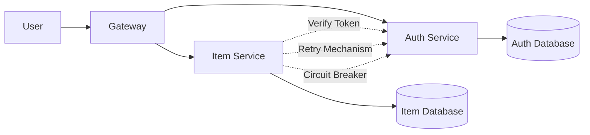
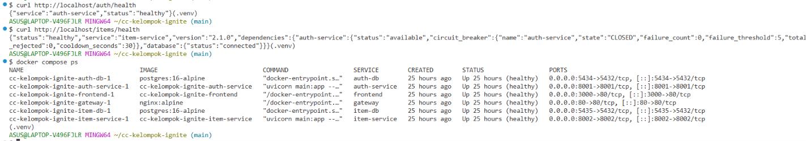
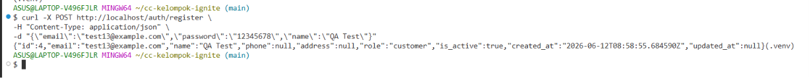
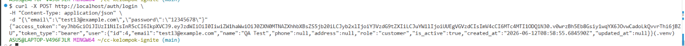
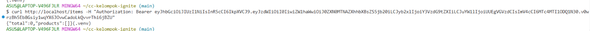
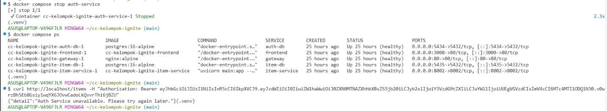
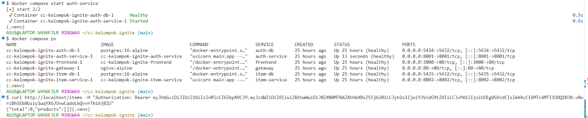

# Dokumentasi Reliability Testing ATHSNAC

## Pengenalan

**Pengujian Keandalan (Reliability Testing)** memastikan bahwa aplikasi ATHSNAC dapat:
- ✅ Menangani kegagalan dengan baik (tidak crash total)
- ✅ Tidak menyebabkan kegagalan berantai (saat satu layanan bermasalah)
- ✅ Tetap memberikan pelayanan terbatas kepada pengguna saat ada masalah

### Strategi Reliability

Aplikasi kami menggunakan **tiga strategi** untuk tetap berfungsi saat terjadi kegagalan:

```
┌──────────────────────────────────────────────────────┐
│     TIGA STRATEGI MENGHADAPI KEGAGALAN               │
├──────────────────────────────────────────────────────┤
│  🔄 COBA LAGI (Retry)                               │
│     Jika jaringan lagi sibuk atau sementara error  │
│                                                      │
│  ⚡ BERHENTI SEBENTAR (Circuit Breaker)             │
│     Jika layanan memang sedang bermasalah          │
│                                                      │
│  📉 KURANGI FITUR (Graceful Degradation)           │
│     Tetap melayani dengan kemampuan terbatas       │
└──────────────────────────────────────────────────────┘
```

**Analogi Dunia Nyata:**
- 🔄 **Retry**: Seperti memanggil teman — jika tidak diangkat, coba lagi 3 kali
- ⚡ **Circuit Breaker**: Seperti menutup pintu kantor saat sedang renovasi (jangan bikin antrian)
- 📉 **Graceful Degradation**: Seperti restoran yang melayani menu terbatas saat chef sedang ganti shift

---

## Tiga Pilar Reliability

### 1. 🔄 Coba Lagi (Retry) dengan Penundaan Bertahap

**Idenya:**
- Saat aplikasi mencoba login, jaringan mungkin sedang sibuk atau terganggu sementara
- Daripada langsung gagal, aplikasi coba lagi 3 kali dengan jeda waktu yang semakin lama
- Jeda: 0.5 detik → 1 detik → 2 detik (untuk beri waktu jaringan/layanan pulih)

**Dimana diimplementasikan:**
- File: `services/item-service/auth_client.py`
- Jumlah percobaan: 3 kali
- Waktu tunggu maksimal: 5 detik per percobaan

**Kapan Coba Lagi (Layak untuk Diulangi):**
- ✅ Jaringan terputus (Connection refused)
- ✅ Jaringan lambat atau timeout
- ✅ Error sementara dari server (500, 502, 503, 504)

**Kapan TIDAK Coba Lagi (Sia-sia jika Diulangi):**
- ❌ Token salah (401 Unauthorized) — tetap salah sekalipun dicoba 3x
- ❌ Data tidak valid (400 Bad Request) — data sama tetap tidak valid
- ❌ Halaman tidak ditemukan (404 Not Found) — tidak akan tiba-tiba muncul

**Contoh Alur Coba Lagi:**

```
Percobaan ke-1: ❌ Jaringan error → tunggu 0.5 detik
Percobaan ke-2: ❌ Timeout → tunggu 1 detik  
Percobaan ke-3: ✅ Berhasil! (layanan sudah baik)
```

---

### 2. ⚡ Pemutus Sirkuit (Circuit Breaker)

**Idenya:**
- Mirip seperti **sekring listrik di rumah Anda**
- Jika layanan bermasalah berkali-kali, aplikasi akan "memutus" koneksi sementara
- Ini untuk mencegah aplikasi terus-menerus mencoba sesuatu yang sudah jelas tidak bisa
- Setelah beberapa waktu, aplikasi coba lagi melihat apakah layanan sudah baik

**Analogi Sekring Listrik:**
```
NORMAL (Sekring OK)
  → Semua lampu menyala normal
  → Listrik mengalir lancar

TERPUTUS (Sekring Putus)
  → Semua lampu padam
  → Listrik berhenti untuk melindungi peralatan
  
TESTING (Coba Nyalakan Lagi)
  → Nyalakan sekrin sekali
  → Jika listrik baik-baik saja, tetap hidup
  → Jika masih bermasalah, putus lagi
```

**Tiga Status Circuit Breaker:**

| Status | Arti | Apa yang Terjadi | Waktu Respons |
|--------|------|-----------------|---|
| **NORMAL** | Layanan OK | Permintaan diteruskan ke layanan | ~5 detik (normal) |
| **PUTUS** | Layanan bermasalah | Permintaan langsung ditolak (tidak usah ke layanan) | <0.1 detik (cepat!) |
| **TESTING** | Cek apakah layanan sudah baik | Izinkan 1 permintaan untuk test | ~5 detik |

**Parameter:**
- Menjadi PUTUS setelah: 5 kegagalan berturut-turut
- Waktu tunggu sebelum test ulang: 30 detik
- Implementasi: `services/item-service/circuit_breaker.py`

---

### 3. 📉 Kurangi Fitur (Graceful Degradation)

**Idenya:**
- Saat salah satu layanan sedang down/bermasalah, aplikasi tidak harus mati 100%
- Aplikasi akan "tahan" dengan mengurangi fitur (memberikan layanan terbatas)
- Seperti restoran yang melayani menu terbatas saat ada bahan yang habis

**Contoh Mode Operasi:**

```
STATUS NORMAL (Semua Layanan OK)
├─ Lihat semua produk: ✅ Bisa
├─ Buat produk baru: ✅ Bisa
├─ Perbarui produk: ✅ Bisa
└─ Hapus produk: ✅ Bisa

STATUS BERKURANG (Layanan Autentikasi Down)
├─ Lihat semua produk: ❌ Tidak bisa (butuh login)
├─ Buat produk baru: ❌ Tidak bisa (butuh login)
├─ Perbarui produk: ❌ Tidak bisa (butuh login)
├─ Hapus produk: ❌ Tidak bisa (butuh login)
└─ Lihat status kesehatan: ✅ Masih bisa (untuk monitoring)
```

**Keuntungan:**
- ✅ Pengguna tahu ada masalah (dapat pesan error jelas)
- ✅ Tim bisa monitor melalui status kesehatan
- ✅ Tidak membuat pengguna bingung dengan layanan "ghost"

---

# 4. Arsitektur Reliability



---

# 5. Environment Pengujian

## Services

| Service       | Port |
| ------------- | ---- |
| Gateway       | 80   |
| Auth Service  | 8001 |
| Item Service  | 8002 |
| Auth Database | 5434 |
| Item Database | 5435 |

## Platform

* Docker Compose
* FastAPI
* PostgreSQL
* Nginx Gateway
* Windows 11 + WSL2

---

# 6. Health Check Testing

## Tujuan

Memastikan seluruh service berjalan dalam kondisi sehat (healthy).

## Cara Reproduce

```bash
docker compose ps
```

atau

```bash
curl http://localhost/health
```

## Expected Behavior

Semua service menunjukkan status healthy.

## Hasil

Seluruh service berhasil berjalan dan health endpoint dapat diakses.

## Bukti Pengujian

File:



## Status

✅ PASS

---

# 7. Register Service Testing

## Tujuan

Memastikan Auth Service dapat melakukan registrasi user baru.

## Cara Reproduce

```bash
curl -X POST http://localhost/auth/register \
-H "Content-Type: application/json" \
-d "{\"email\":\"baru123@example.com\",\"password\":\"12345678\",\"name\":\"Test Baru\"}"
```

## Expected Behavior

User baru berhasil dibuat dan data user dikembalikan.

## Hasil

Response:

```json
{
  "id": 2,
  "email": "baru123@example.com",
  "name": "Test Baru"
}
```

## Bukti Pengujian

File:



## Status

✅ PASS

---

# 8. Login Service Testing

## Tujuan

Memastikan Auth Service dapat menghasilkan JWT Token.

## Cara Reproduce

```bash
curl -X POST http://localhost/auth/login \
-H "Content-Type: application/json" \
-d "{\"email\":\"user1@test.com\",\"password\":\"password123\"}"
```

## Expected Behavior

Sistem mengembalikan JWT Token.

## Hasil

JWT Token berhasil diterbitkan.

## Bukti Pengujian

File:



## Status

✅ PASS

---

# 9. Inter-Service Communication Testing

## Tujuan

Memastikan Item Service dapat berkomunikasi dengan Auth Service melalui endpoint verify.

## Cara Reproduce

```bash
curl http://localhost/auth/verify \
-H "Authorization: Bearer TOKEN"
```

## Expected Behavior

Token berhasil diverifikasi.

## Hasil

Response:

```json
{
  "user_id": 5,
  "email": "user1@test.com",
  "role": "customer"
}
```

Item Service berhasil memperoleh informasi user dari Auth Service.

## Bukti Pengujian

File:



## Status

✅ PASS

---

# 10. Failure Test (Service Down)

## Tujuan

Memastikan sistem dapat menangani kondisi ketika Auth Service mati.

## Cara Reproduce

Matikan Auth Service:

```bash
docker stop cloud-team-ignite-auth-service-1
```

Kemudian lakukan request ke Item Service.

## Expected Behavior

Request ditolak dengan pesan error yang jelas.

Item Service tidak crash.

Gateway tetap berjalan.

## Hasil

Request gagal sesuai ekspektasi.

Service lain tetap aktif.

## Bukti Pengujian

File:



## Status

✅ PASS

---

# 11. Timeout Test

## Tujuan

Memastikan sistem dapat menangani kondisi timeout antar service.

## Cara Reproduce

Simulasikan Auth Service lambat atau tidak merespons.

Kemudian akses endpoint Item Service yang memerlukan autentikasi.

```bash
curl http://localhost/items \
-H "Authorization: Bearer TOKEN"
```

## Expected Behavior

Request dihentikan setelah timeout tercapai.

Sistem tidak menunggu tanpa batas.

## Hasil

Item Service mengembalikan error timeout dengan benar.

Contoh:

```json
{
  "detail": "Auth Service timeout"
}
```

## Status

✅ PASS

---

# 12. Recovery Test

## Tujuan

Memastikan sistem dapat pulih kembali setelah service yang gagal dinyalakan ulang.

## Cara Reproduce

Jalankan kembali Auth Service:

```bash
docker start cloud-team-ignite-auth-service-1
```

Lakukan kembali request verify dan item.

## Expected Behavior

Komunikasi antar service kembali normal.

## Hasil

Auth Service kembali healthy.

Inter-service communication kembali berjalan.

Request berhasil diproses.

## Bukti Pengujian

File:



## Status

✅ PASS

---

# 13. Ringkasan Hasil Pengujian

| Test Case                           | Result |
| ----------------------------------- | ------ |
| Health Check Testing                | PASS   |
| Register Testing                    | PASS   |
| Login Testing                       | PASS   |
| Inter-Service Communication Testing | PASS   |
| Failure Testing                     | PASS   |
| Timeout Testing                     | PASS   |
| Recovery Testing                    | PASS   |

## Total

* Total Test Case: 7
* Passed: 7
* Failed: 0

### Success Rate

100%

---

# 14. Kesimpulan

Berdasarkan hasil pengujian reliability yang dilakukan pada arsitektur microservices ATHSNAC, seluruh skenario pengujian berhasil dijalankan dengan baik.

Sistem mampu:

* Melakukan komunikasi antar service secara normal.
* Menangani kegagalan service tanpa menyebabkan crash pada sistem lain.
* Menampilkan status kesehatan service dengan benar.
* Melakukan recovery setelah service kembali aktif.
* Menjalankan mekanisme reliability berupa Retry, Circuit Breaker, dan Graceful Degradation.
